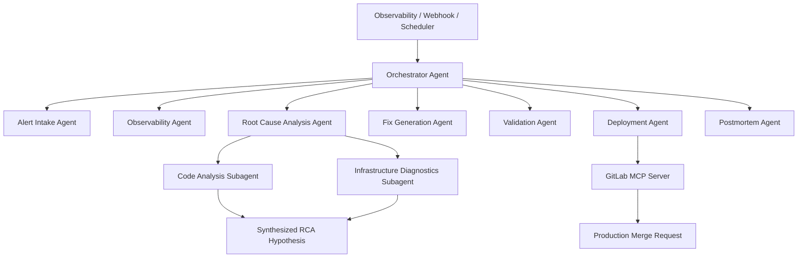

# Always-On-CallSRE 🤖🛠️
### Autonomous AI On-Call SRE Agent Platform

Always-On-CallSRE is a multi-agent, autonomous Site Reliability Engineering (SRE) platform designed to monitor cloud-native systems, detect failures, perform root cause analysis (RCA), generate fixes, validate solutions, create merge requests, and automatically draft postmortem reports. 

Instead of waking up human engineers at 2:00 AM to manually triage alert fatigue and troubleshoot complex distributed systems, Always-On-CallSRE acts as a first-response AI SRE that runs 24/7/365 to proactively protect and heal production applications.

---

## The Vision

Modern SRE and DevOps teams face severe alert fatigue, high Mean Time to Resolution (MTTR), and complex incident investigations. When production breaks, engineers spend critical hours hunting logs, correlating metrics, writing hotfixes, and documenting postmortems.

**Always-On-CallSRE** solves this by establishing a hierarchical agent platform using **Google Gemini 2.5 Pro** and the **Model Context Protocol (MCP)**. It bridges the gap between observability and code repository actions, moving organizations from **reactive fire-fighting** to **proactive auto-healing**.

---

## System Architecture

The platform is designed around a multi-tier, event-driven multi-agent system:



### 1. Hierarchical Subagent Delegation
For complex, high-overhead tasks, primary agents act as managers that delegate to specialized, focused subagents:
* **Root Cause Analysis (RCA) Agent (Manager)**: Analyzes the high-level context and spins up:
  * **Code Analysis Subagent**: Scours Git commit history, code structure, and application logs for code-level faults.
  * **Infrastructure Subagent**: Deep dives into CPU, memory trends, database connections, and network metrics.
* **Synthesis**: The RCA Agent merges findings from both subagents to form a highly accurate, cohesive root cause hypothesis.

### 2. Proactive AI Monitoring
Equipped with a background cron engine (`APScheduler`), a dedicated **Proactive Monitoring Agent** runs every 10 minutes:
* It scans system telemetry (Prometheus metrics, CPU trends, error rates).
* It asks Gemini to predict leading indicators of an outage (e.g., progressive memory leaks or slow resource exhaustion).
* If an anomaly is predicted, it autonomously initiates the full diagnostics and auto-healing pipeline *before* the system triggers a hard down alert.

---

## The Agent Roster

1. **Proactive Monitoring Agent**: Continually runs background telemetry audits to capture anomalies early.
2. **Alert Intake Agent**: Parses raw alert payloads (GitLab pipelines, Prometheus alerts) and categorizes impact and severity.
3. **Observability Agent**: Gathers logs and metrics (integrating with Prometheus/Grafana or utilizing rich simulated telemetry fallbacks).
4. **Root Cause Agent (with Subagents)**: Diagnoses the specific system faults (CPU leaks, OOM crashes, bug regressions).
5. **Fix Generation Agent**: Writes complete, production-grade code patches to resolve the root cause.
6. **Validation Agent**: Tests the generated patch for compilation, functional correctness, and security vulnerabilities.
7. **Deployment Agent**: Interacts with the **GitLab MCP Server** to autonomously open a Merge Request containing the patch.
8. **Postmortem Agent**: Compiles an in-depth markdown incident postmortem, capturing timeline, root cause, fix, and recommendations.

---

## Tech Stack

* **Core**: Python 3.14 (Flask Backend)
* **LLM Engine**: Google GenAI SDK (`gemini-2.5-pro` for dynamic reasoning and patch generation)
* **Agent Integration**: custom multi-agent orchestration mimicking the Google ADK patterns
* **Tooling Protocol**: Model Context Protocol (MCP) using the Python `mcp` SDK to interface with GitLab
* **Scheduling**: `APScheduler` for proactive cron loops
* **Frontend**: Beautiful glassmorphic HTML5/Vanilla CSS/JS dashboard featuring a live-updating mockup terminal stream and typewriter animations.

---

## Live Demo Features

To facilitate a seamless hackathon pitch, the dashboard is equipped with:
* **"Trigger Simulated Incident"**: Immediately triggers the reactive pipeline simulating a pipeline failure on a frontend service.
* **"Run Proactive AI Scan"**: Simulates a telemetry sweep, flags an anomaly (e.g., a memory leak), and triggers auto-healing.
* **Mac-style Live Terminal UI**: Streams real-time orchestrator prints side-by-side with the agent cards, showing step-by-step how agents think and delegate to subagents.

---

## Setup & Installation

### Prerequisites
* Python 3.14+
* Node.js (for GitLab MCP tool capabilities)

### Installation
1. Clone the repository:
   ```bash
   git clone https://github.com/yourusername/Always-On-CallSRE.git
   cd Always-On-CallSRE
   ```

2. Install dependencies:
   ```bash
   pip install -r requirements.txt
   ```

3. Configure your Environment Variables:
   Create a `.env` file in the root directory:
   ```env
   GEMINI_API_KEY=your_gemini_api_key_here
   ```

4. Run the application:
   ```bash
   python main.py
   ```

5. Access the Dashboard:
   Open your browser to `http://localhost:8080/`.

---

## 🤝 License
This project is licensed under the MIT License - see the LICENSE file for details.
